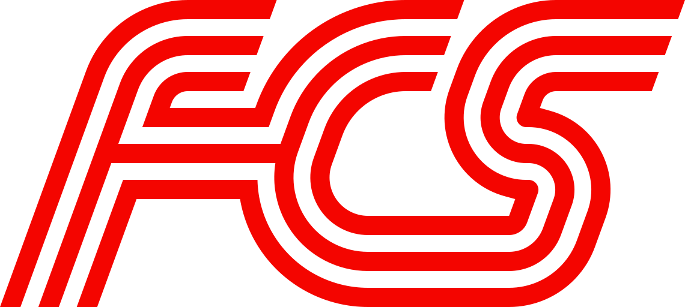
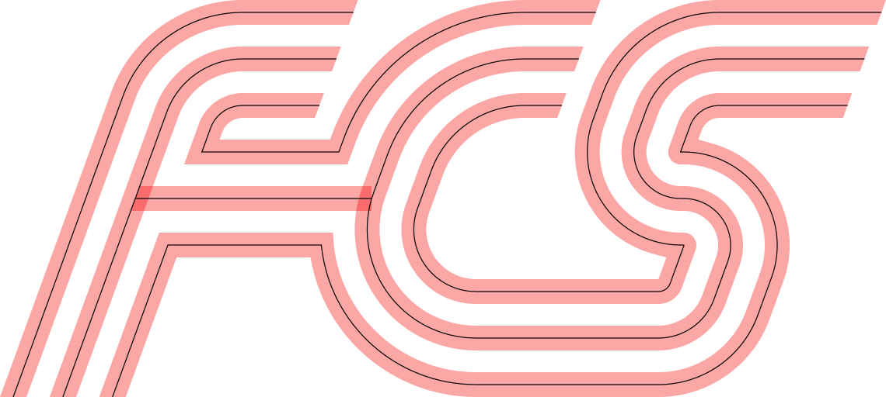
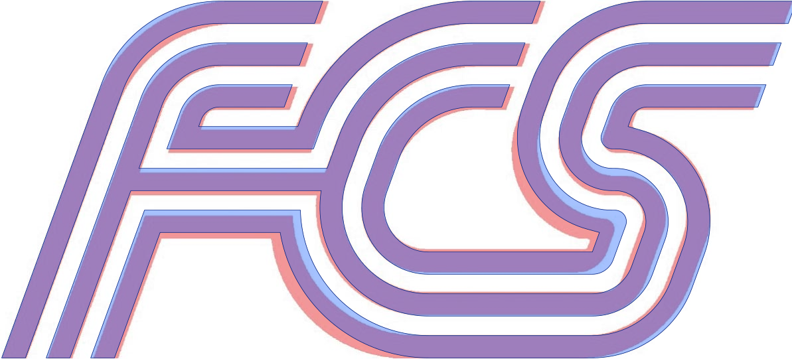

<div align="center">



# FCS logo

**An exact, parametric vector construction of the club logo.**

Three red lines per stroke, two white gaps, one angle, and every gap exactly equal.

`#f40500` · 70° slant · red : white = 8 : 7

</div>

---

## Quick start

The project uses [pixi](https://pixi.sh/), which installs Python, the two Python
dependencies (`numpy`, `skia-pathops`), ImageMagick and librsvg into one reproducible
environment defined by `pixi.toml` and pinned by `pixi.lock`. Nothing needs to be
installed system-wide.

```bash
# pixi itself, if you do not have it:
#   curl -fsSL https://pixi.sh/install.sh | bash
pixi install                           # creates .pixi/ with the pinned toolchain
pixi run build                         # writes to out/
pixi run python -m fcs.build out-test  # or to any other folder
```

`pixi run build` is the shorthand for `pixi run python -m fcs.build`.

Every run prints the logo size, the one derived radius, and the result of the
white-gap check. If a parameter asks for geometry that cannot exist, the build stops
with an error that names the straight or corner that does not fit.

```text
size 285.027 x 128.000 units (top 124.000)
derived S bowl inner radius s_bowl = 0.1089
boundary points: 33343, smallest white gap: 6.99999 (target 7.0) near x=223.2 y=30.1
```

### Outputs

| File | Content |
|---|---|
| `fcs.svg` | The logo: one red path on transparent. This is the production file. |
| `fcs.png` | Preview of `fcs.svg`. |
| `construction.svg` | Stripe outlines and centerlines, with true circular arcs. |
| `overlay.png` | The construction (blue) over the original raster `original/old_logo2.jpg`. |

<table>
  <tr>
    <th>construction.svg</th>
    <th>overlay.png</th>
  </tr>
  <tr>
    <td></td>
    <td></td>
  </tr>
</table>

## Changing the geometry

All design decisions are fields of `Params` in [`fcs/logo.py`](fcs/logo.py). Change a
value and run the build again. Units are arbitrary (the logo is 128 units high).
Radii are centerline radii of the *innermost* stripe of a corner. The two outer
stripes automatically get +1 and +2 pitch.

| Parameter | Default | Meaning |
|---|---:|---|
| `red`, `white` | 8, 7 | Stripe width and gap width. Pitch = red + white. |
| `slant` | 70 | Angle of all slanted strokes, in degrees. |
| `col_f` | 50 | F stem, outer stripe. Columns are given as x at the top row. |
| `col_c` | 126 | C, outer stripe. |
| `col_s_top` | 204 | S upper-left column, outer stripe. |
| `col_s_bottom` | 248 | S lower-right column, inner stripe. |
| `f_top` | 10 | F top-left corner. |
| `c_top` | 20 | C top-left corner. |
| `c_bowl` | 20 | C bottom-left corner. |
| `s_foot` | 4 | S bottom-right corner. |
| `s_top` | 10 | S top-left corner. |
| `s_mid` | 1 | Length of the horizontal S middle. |
| `s_waist` | 0 | S middle, left corner (0 = sharp inner corner). |
| `s_drop` | 0 | Moves the S middle down. At 0 it is level with the F crossbar. |
| `RED` | `#f40500` | Fill colour, at the top of [`fcs/build.py`](fcs/build.py). |

**Limits worth knowing**

- **S middle.** It is defined by three lines: the upper column, the middle row and
  the lower column. Its bowl radius `s_bowl` is *derived*, not set. The build stops if
  `col_s_bottom < col_s_top + s_mid + tan 55° · (2·pitch + s_waist)`, and the message
  tells you the smallest `col_s_bottom` that fits.
- **Upper-left S straight.** Its length is `pitch/sin 70° − tan 55°·s_waist − tan 35°·s_top + s_drop/sin 70°`.
  `s_drop` takes that length away from the straight of the lower bowl.
- **Corner radius 0.** Any radius ≥ 0 is valid. Where an edge offset would turn a
  radius negative (the inner side of a tight corner), the edge becomes a mitred
  vertex, which is the exact offset.

## Implementation details

### Model

The crest is built on a grid:

- 9 horizontal rows at `y = (8 − k) · pitch`.
- Columns at `slant`, spaced exactly one pitch apart (perpendicular distance).

On this grid the logo is 6 continuous stripes plus the F crossbar:

| Stripe | Route |
|---|---|
| A, B | F stem into the top rows of the F. |
| H | F inner loop, turns into the outer stripe of the C. |
| Main | F stem, lower arm, C bowl, S bottom, S middle, S top. |
| D, E | C, then the whole S. |
| crossbar | Straight bar on row 4 from B into D, joined with hard corners. |

### Stripes are belts

Each stripe centerline is a *belt* ([`fcs/geometry.py`](fcs/geometry.py)): it starts on
a line, wraps around a sequence of pulleys (circles) and ends on a line. Each belt
has a cut line at each end. The straights between pulleys are computed as common
tangents, so the whole curve is continuous in position and direction.

The key property is that **offsetting a belt is exact**. Lines shift by `d`, and
every pulley keeps its centre while its signed radius changes by `−d`. From this:

- The two edges of a stripe are the offsets ±red/2 of its centerline.
- Neighbouring stripes share their corner centres and their radii differ by exactly
  one pitch. That is why every white gap equals `white`: it follows from the
  construction, not from fitting.

### Corner types

| Kind | Constructor | Behaviour under offset |
|---|---|---|
| Fillet | `corner(l_in, l_out, r)` | Concentric arc. The edge becomes a mitre where its radius would be negative. |
| Sharp | `sharp(l_in, l_out)` | Mitred on both sides. The vertex moves along the bisector, so offsets stay parallel. |
| Knee | `knee(c, r, l_in)` | A line meets a circle at a hard angle. Used where the F lower arm drops onto the C bowl. |

Consecutive fillets on the same grid line must keep their straight *on* that line.
For centerlines this is enforced: a negative length raises an error instead of
silently tilting the straight.

### Cuts

- **F stems:** cut at `y = −red/2`, the bottom edge of the bottom row under the C and S.
- **F and C row ends:** cut parallel to the slant, one white gap before the next
  letter's outer stripe.
- **S row ends:** cut on the right edge of the lower S bowl, the same line
  (collinear) with it.

### Output pipeline ([`fcs/build.py`](fcs/build.py))

1. Build the outline of each stripe from its two offset edges and the two cut
   segments, plus the crossbar polygon.
2. Convert arcs to cubic Béziers in ≤ 30° pieces (error ≈ 4·10⁻⁷ · radius), then merge
   everything into one path with `skia-pathops`.
3. Write `fcs.svg` (merged path) and `construction.svg` (exact `A` arc commands).
   Render the PNGs with ImageMagick.
4. **Check** the result: sample the merged outline every 0.1 units. For every pair of
   boundary points whose midpoint lies in white, the distance must be ≥ `white`.

### Files

| Path | Role |
|---|---|
| `fcs/geometry.py` | Vector helpers, `Line`, `Pulley`, belts, exact offsets, arc → cubic. |
| `fcs/logo.py` | `Params` and the construction of all stripes on the grid. |
| `fcs/build.py` | Outlines, union, SVG/PNG export, gap check, overlay. |
| `pixi.toml`, `pixi.lock` | Environment and tasks, with pinned versions. |
| `original/` | Reference scans of the original crest. |
